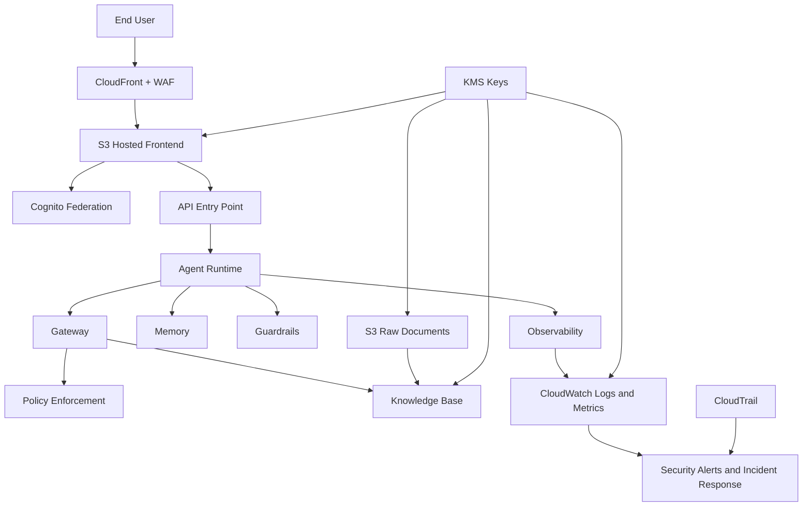

# Bench Press Proposal Tool - High-Level Security Architecture

## 1) Scope

This document defines high-level security architecture for the target AWS-based system described in `system-architecture.md`.

It covers:
- Identity and access control
- Data protection and key management
- Network and application protection
- AI safety and policy enforcement
- Logging, monitoring, and auditability

## 2) Security Principles

- Least privilege for all human and machine identities
- Defense in depth across edge, app, data, and AI layers
- Explicit trust boundaries and deny-by-default policy model
- Encryption in transit and at rest for all sensitive assets
- Full auditability for security and compliance operations

## 3) Trust Boundaries

1. User Edge Boundary
- User devices to CloudFront endpoint over TLS.

2. Application Boundary
- API entry point and agent runtime components.

3. Data Boundary
- Document storage, metadata stores, and retrieval systems.

4. AI Boundary
- Agent runtime, tool invocation, memory, and model interactions.

5. Operations Boundary
- Monitoring, audit logging, and incident response workflows.

## 4) Security Control Architecture

### 4.1 Identity and Access

- Use enterprise SSO federation through Cognito for user authentication.
- Enforce role-based access through IAM for platform operators and services.
- Use workload identities for runtime services and short-lived credentials.
- Restrict tool access through a deterministic policy layer at the gateway boundary.

### 4.2 Edge and Application Protection

- Host frontend with CloudFront and protect with AWS WAF.
- Use TLS for all inbound and service-to-service communication.
- Validate and sanitize all user inputs before downstream processing.
- Apply request throttling/rate control at API entry points.

### 4.3 Data Protection

- Store source documents in Amazon S3 with SSE-KMS.
- Encrypt metadata stores and logs with KMS-managed keys.
- Separate raw documents from processed/indexed artifacts by storage path and IAM policy.
- Use object-level and bucket-level access policies to prevent broad read access.

### 4.4 AI and Tooling Security

- Apply Bedrock Guardrails to user prompts and generated responses.
- Enforce tool-call authorization using gateway policy controls.
- Limit agent memory scope by user/session boundaries.
- Use retrieval filters and source controls to reduce over-broad data exposure.

### 4.5 Monitoring, Audit, and Response

- Centralize runtime and security logs in CloudWatch.
- Record control-plane actions with CloudTrail.
- Enable security posture and threat detection services for continuous visibility.
- Define alert thresholds for auth failures, policy denials, anomalous access, and ingestion failures.

## 5) High-Level Security Diagram

## 6) Baseline Security Requirements

- All critical data paths use TLS and KMS-backed encryption.
- No shared static credentials in code or configuration files.
- IAM policies scoped to explicit resources and actions.
- Logging enabled for auth events, policy decisions, and data access operations.
- Security review required for new integrations and tool onboarding.

## 7) Open Security Decisions

- Define exact data classification levels and retention periods.
- Define production incident response runbook and on-call ownership.
- Define break-glass access process for privileged emergency operations.
- Define cross-account boundary model if a multi-account landing zone is adopted.
