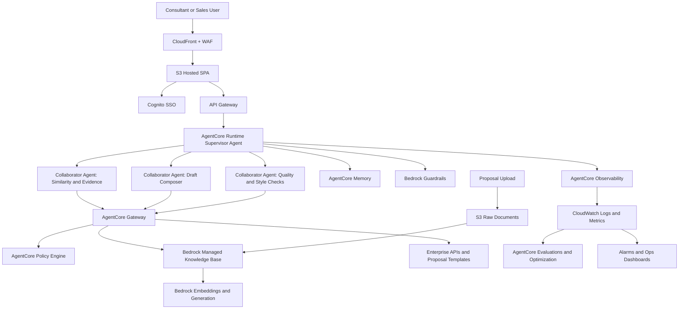

# Bench Press Proposal Tool - High-Level AWS System Architecture

## 0) 2026 Recommendation (Executive Summary)

For new builds, use **Amazon Bedrock AgentCore** as the primary agent platform.

Recommended 2026 target stack:
- **Agent runtime**: AgentCore Runtime (session-isolated, serverless scaling)
- **Orchestration**: Supervisor + specialist collaborator agents
- **Tooling and governance**: AgentCore Gateway + AgentCore Policy (Cedar)
- **Retrieval default**: Bedrock Managed Knowledge Base (agentic retrieval, managed reranking, connectors, ACL-aware retrieval)
- **Memory**: AgentCore Memory (short-term and long-term)
- **Safety**: Bedrock Guardrails + deterministic policy boundaries
- **Quality loop**: AgentCore Evaluations + Optimization (recommendations and A/B testing)
- **Observability**: AgentCore Observability + CloudWatch + OTEL

Use customer-managed OpenSearch retrieval only when strict custom index control or existing platform constraints require it.

## 1) Context and Problem Statement

The current repository implements a browser-only prototype:
- Static single-page app in `index.html`
- Local proposal corpus in `proposals.js`
- In-browser semantic matching using a Hugging Face model loaded from CDN
- No backend API, no persistent storage, no auth, and no ingestion pipeline

This works for a demo, but it does not scale for enterprise proposal search because proposal content, access control, auditability, and compute all need to be centralized and secure.

## 2) Target Architecture Goals

- Secure enterprise access with SSO
- Centralized proposal ingestion and normalization (PDF/DOCX/TXT)
- Fast semantic and keyword retrieval over large corpora
- Explainable matches (scores, excerpts, source references)
- Draft proposal generation with guardrails and citations
- Operational visibility, governance, and cost controls

## 3) Recommended AWS High-Level Architecture

### 3.1 Frontend and Edge
- **Amazon S3 + CloudFront** for hosting the SPA
- **AWS WAF + AWS Shield** in front of CloudFront
- **Amazon Cognito** (federated with enterprise IdP via SAML/OIDC) for authentication

### 3.2 API and Application Layer
- **Amazon API Gateway** as the public API facade
- **AWS Lambda** for core APIs (search, result explainability, draft generation orchestration)
- **Amazon ECS Fargate** (optional) for heavier long-running services if Lambda limits are exceeded

### 3.3 Data and Knowledge Layer
- **Amazon S3 (raw zone)** for uploaded proposal files and source artifacts
- **Amazon Textract** for OCR/text extraction from scanned PDFs
- **AWS Step Functions** to orchestrate ingestion pipeline
- **AWS Lambda** for text cleaning, chunking, metadata enrichment
- **Amazon OpenSearch Service**
  - BM25/keyword index for lexical retrieval
  - Vector index for embedding similarity search
- **Amazon DynamoDB** for proposal metadata, ingestion status, and user feedback

### 3.4 AI/ML Layer
- **Amazon Bedrock** for:
  - Embeddings (for proposal chunks and query embeddings)
  - LLM text generation for draft proposal output
- Retrieval-Augmented Generation (RAG):
  - Hybrid retrieval from OpenSearch (keyword + vector)
  - Re-ranking and top-k chunk selection
  - Prompt assembly with citations

### 3.5 Security, Audit, and Operations
- **AWS KMS** for encryption keys (S3, OpenSearch, DynamoDB)
- **IAM + least privilege** for service roles
- **CloudTrail** for API and control-plane audit logs
- **CloudWatch** for metrics, logs, alarms, dashboards
- **AWS X-Ray** for distributed tracing
- **AWS Config + Security Hub + GuardDuty** for posture management

## 4) High-Level Data Flow

1. User authenticates through Cognito (federated SSO).
2. User submits problem statement, supplemental context, and optional files.
3. API Gateway routes request to Search API (Lambda).
4. Search API creates query embeddings via Bedrock.
5. Hybrid retrieval runs in OpenSearch (vector + keyword).
6. API composes ranked results with excerpts, scores, and source references.
7. User selects top proposals and requests draft generation.
8. Draft API retrieves selected chunks and calls Bedrock LLM with citation-focused prompt.
9. Draft response returns structured sections (approach, timeline, assumptions, references).

## 5) Ingestion Pipeline (Proposal Corpus)

1. Proposal file uploaded to S3 raw zone.
2. S3 event triggers Step Functions workflow.
3. Pipeline stages:
   - Extract text (Textract where needed)
   - Normalize and chunk content
   - Generate embeddings (Bedrock)
   - Index chunks into OpenSearch
   - Persist metadata/state in DynamoDB
4. Pipeline emits metrics and failures to CloudWatch alarms.

## 6) Logical Architecture Diagram

## 7) Mapping from Current Prototype to AWS Target

- `index.html` UI -> S3 + CloudFront hosted SPA
- In-browser model/CDN inference -> Bedrock-managed embedding and generation APIs
- `proposals.js` local corpus -> S3 + OpenSearch indexed corpus
- Client-only matching -> API-driven hybrid retrieval service
- No auth -> Cognito federated SSO
- No persistence -> DynamoDB metadata + feedback storage

## 8) Non-Functional Considerations

- **Scalability**: OpenSearch shard sizing based on corpus growth and query QPS
- **Latency**: Target p95 search response under 2s for top-k retrieval
- **Security**: End-to-end TLS, encryption at rest with KMS, per-user authorization checks
- **Reliability**: Multi-AZ managed services, DLQs for failed ingestion tasks
- **Cost**: Use Lambda for bursty API demand, tune OpenSearch hot/warm tiers, monitor Bedrock token usage

## 9) Suggested Implementation Phases

1. Phase 1 (MVP on AWS)
   - Host SPA on S3/CloudFront
   - Add API Gateway + Lambda search endpoint
   - Move corpus to OpenSearch vector index
2. Phase 2 (Enterprise readiness)
   - Add Cognito SSO, WAF, audit controls, full ingestion pipeline
3. Phase 3 (Advanced intelligence)
   - Hybrid reranking, feedback loop, domain prompts, success-weighted ranking

## 10) Outcome

This architecture preserves the user workflow from the current prototype while upgrading it to an enterprise-grade AWS platform with secure access, scalable retrieval, governed AI generation, and production observability.

