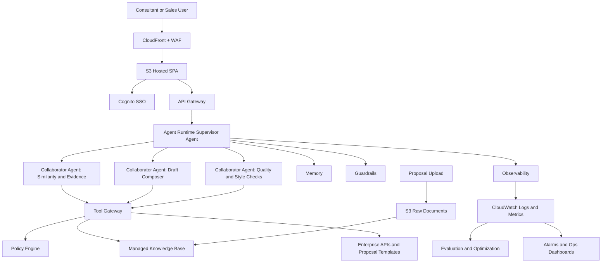
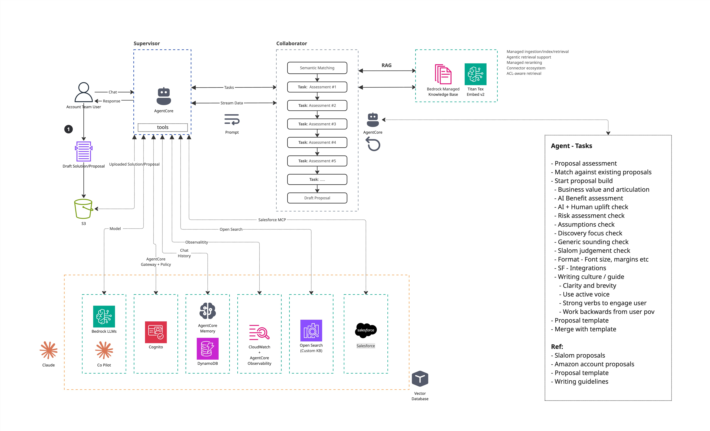

# Bench Press Proposal Tool - High-Level AWS System Architecture

## 1) Context and Problem Statement

The current repository implements a browser-only prototype:

- Static single-page app in `index.html`
- Local proposal corpus in `proposals.js`
- In-browser semantic matching using a Hugging Face model loaded from CDN
- No backend API, no persistent storage, no authentication, and no
  ingestion pipeline

This works for a demo, but it does not scale for enterprise proposal search
because proposal content, access control, auditability, and compute need to be
centralized and secure.

## 2) Target Architecture Goals

- Secure enterprise access with SSO
- Centralized proposal ingestion and normalization (PDF, DOCX, TXT)
- Fast similarity retrieval with source-backed evidence
- Draft generation with safety controls and citations
- Operational visibility, governance, and cost controls

## 3) Recommended AWS High-Level Architecture

### 3.1 Frontend and Edge

- Amazon S3 + CloudFront for hosting the SPA
- AWS WAF in front of CloudFront
- Amazon Cognito (federated with enterprise IdP via SAML or OIDC)

### 3.2 Runtime and Orchestration

- Amazon API Gateway as the public API facade
- Agent runtime as the orchestration layer
- Supervisor and collaborator agents for:
  - Similarity and evidence extraction
  - Draft composition
  - Quality and style checks

### 3.3 Knowledge and Data Layer

- Amazon S3 for uploaded proposal files and source artifacts
- Bedrock managed knowledge base for retrieval and grounded generation context
- Optional enterprise tools (templates, account data, external APIs)
  accessed through a governed tool gateway

### 3.4 AI Safety, Policy, and Quality

- Guardrails for prompt and response safety
- Policy enforcement for tool-call authorization
- Memory for session and user-context continuity
- Evaluation and optimization loop for response quality improvements

### 3.5 Security, Audit, and Operations

- KMS for encryption keys
- IAM least-privilege service roles
- CloudTrail for control-plane audit logs
- CloudWatch for logs, metrics, and alarms

## 4) High-Level Request Flow

1. User authenticates through Cognito.
2. User submits problem statement, supplemental context, and optional files.
3. API Gateway forwards requests to the agent runtime.
4. Agent runtime retrieves grounded context from the knowledge base.
5. Agent runtime invokes collaborator tasks for ranking, reasoning, and
   drafting.
6. Policy layer governs tool calls; guardrails evaluate prompts and outputs.
7. System returns ranked matches with evidence and optional drafted response.

## 5) Ingestion Flow

1. Proposal files are uploaded to S3.
2. Knowledge-base ingestion syncs content and metadata.
3. Retrieval index is updated and becomes queryable by the runtime.
4. Ingestion and query telemetry are emitted to CloudWatch.

## 6) Logical Architecture Diagram

*Figure 1. Agentic workflow and task-assessment architecture (v1).*

## 7) Mapping from Current Prototype to Target Architecture

- `index.html` UI -> S3 + CloudFront hosted SPA
- In-browser model inference -> managed model invocation through runtime
- `proposals.js` local corpus -> S3-backed managed knowledge base
- Client-only matching -> API and agent-runtime orchestration
- No authentication -> Cognito federated SSO
- No persistence -> managed data stores and governed telemetry

## 8) Non-Functional Considerations

- Scalability: managed runtime and retrieval services scale by demand
- Security: TLS in transit, encryption at rest, and policy-governed access
- Reliability: managed services with monitoring, alarms, and retryable flows
- Cost: monitor token usage, retrieval volume, and logging footprint

## 9) Suggested Implementation Phases

1. Phase 1
   - Host SPA on S3 and CloudFront
   - Add API Gateway and runtime orchestration
   - Move corpus from local JS file to S3-backed managed knowledge base
2. Phase 2
   - Add SSO, policy controls, guardrails, and ingestion governance
3. Phase 3
   - Add quality-evaluation loops, integration expansion, and tuning

## 10) Revision History

- Date: 29-Jul
  - Version: 1.0
  - Author: Pankaj T
  - Notes: Initial architecture draft and baseline flow.
- Date: 29-Jul
  - Version: 1.1
  - Author: Pankaj T
  - Notes: Removed year-specific references, added image asset, and cleaned structure.

